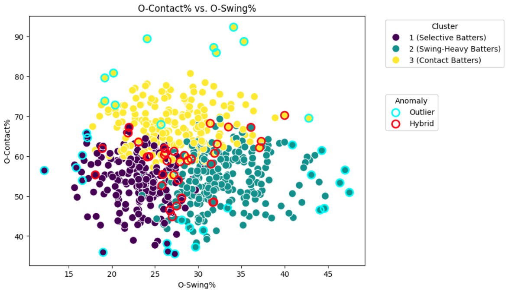
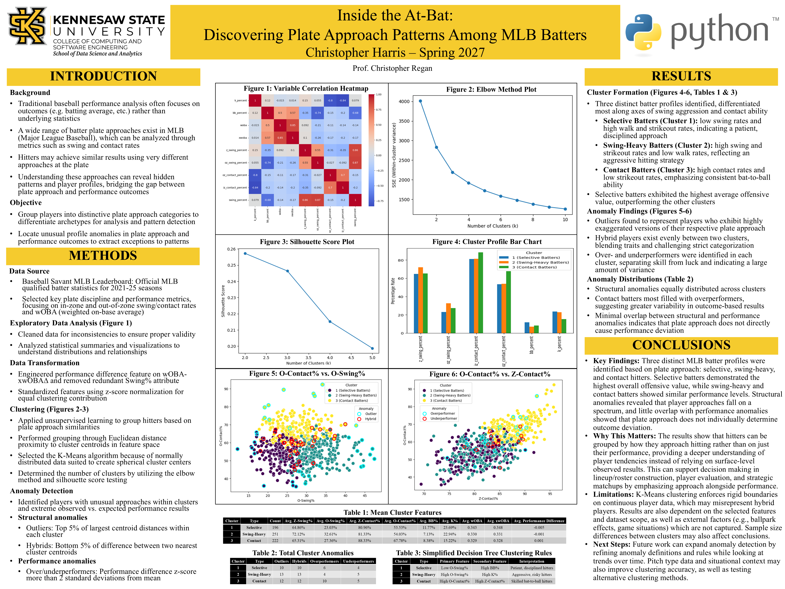

# MLB Plate Approach Mining

**Clustering MLB hitters by plate discipline to uncover hidden offensive archetypes as well as players who deviate from them.**

[](https://www.python.org/)
[](https://mybinder.org/v2/gh/Chris83848/MLB-Data-Mining/HEAD)
[](LICENSE)



## Project Summary

This project applies K-Means clustering and anomaly detection to qualified MLB hitters (2021-2025) to find whether batters have distinct, identifiable approaches at the plate, and if those approaches accurately inform how well they actually hit. The analysis found that hitters fall into three clear categories, but plate discipline alone does not determine offensive success, and a meaningful slice of players defy their own assigned cluster's profile entirely.

## Key Findings

- MLB hitters naturally separate into three distinct plate-approach archetypes: **Selective**, **Contact-based**, and **Swing-heavy**
- Plate discipline does not necessarily correspond to reduced strikeouts
- Strikeout rate alone does not strongly impact weighted on-base average
- Selective batters demonstrate the highest average offensive production despite higher strikeout rates
- A meaningful share of players are **structural outliers** (extreme versions of their cluster) or **hybrids** (blends of two clusters)
- Performance luck (over/underperforming expected stats) appears largely independent of plate approach

## The Three Archetypes

| Archetype | Players | Profile |
|---|---|---|
| **Selective Batters** | 196 | Lowest swing rate, highest walk & strikeout rates, and the strongest overall offensive production. Notably underperforms expected stats, hinting at untapped upside. |
| **Swing-Heavy Batters** | 251 | Highest swing rate, lowest walk rate, elevated strikeouts. Performance tracks closely to league average — a high-variance, aggression-first approach. |
| **Contact Batters** | 222 | Highest contact rate, lowest strikeout rate. Puts the ball in play; performance is similar to Swing-Heavy hitters. |

## Notable Anomalies

Beyond the three core clusters, anomaly detection (via Euclidean distance from cluster centroids) surfaced players who don't fit neatly into any single bucket:

- **Outliers (35 players)** — extreme versions of their own cluster's profile, evenly distributed across all three groups
- **Hybrids (35 players)** — sit almost equally between two clusters, reflecting a genuinely blended approach
- **Overperformers (20 players)** — wOBA significantly exceeds expected wOBA (xwOBA); concentrated most heavily among Contact Batters
- **Underperformers (14 players)** — wOBA significantly trails xwOBA; evenly spread across clusters, suggesting bad luck is less predictable than good luck

## Methodology

1. **Preprocessing** — inspected for missing/duplicate values (none found); univariate analysis showed roughly unimodal, slightly skewed distributions with manageable outliers
2. **Feature engineering** — built a performance differential metric (wOBA − xwOBA) to capture over/underperformance; dropped redundant correlated features
3. **Standardization** — scaled all clustering variables to ensure proportional weighting
4. **Clustering** — K-Means selected for the data's approximately normal, spherical cluster structure; optimal k = 3 confirmed via elbow method and silhouette scores
5. **Anomaly detection** — flagged the top 5% of players by centroid distance (structural) and by performance differential (luck-based)

Full analysis, code, and visualizations are located in [`notebooks/`](notebooks/).

## Repository Structure

- data/ -> dataset used for analysis
- notebooks/ -> Jupyter notebook with full analysis
- docs/ -> milestone reports
- graphs/ -> chart images
- requirements.txt -> Python dependencies required to run the project
- README.md -> Project overview and instructions

## How To Run

**Option 1 — One click, no setup:**
Click the Binder badge above to launch the notebook directly in your browser.

**Option 2 — Local setup:**
```bash
git clone https://github.com/Chris83848/MLB-Data-Mining
cd MLB-Data-Mining
pip install -r requirements.txt
jupyter notebook
```
Then open the notebook in `notebooks/` and run all cells.

## Dataset

Qualified batters, 2021–2025 seasons, sourced from the [Baseball Savant](https://baseballsavant.mlb.com/) MLB leaderboard. Metrics include Z-Swing%, O-Swing%, contact rate, strikeout rate, wOBA, and xwOBA.

## Author

**Christopher Harris** — [GitHub](https://github.com/Chris83848) · [LinkedIn](https://www.linkedin.com/in/christopher-harris9/)

